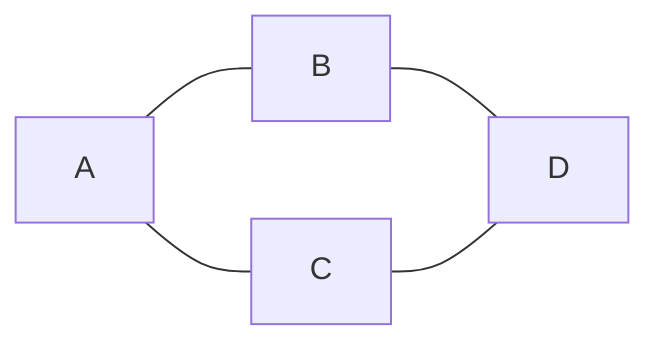
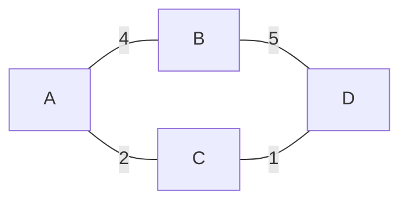
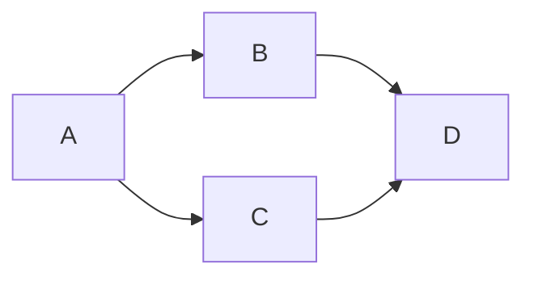
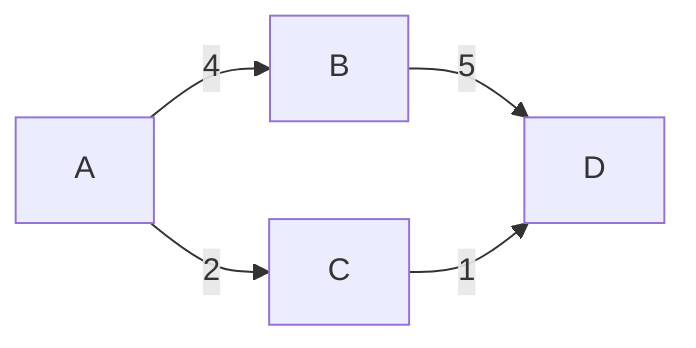

classifying graphs on the basis of edges

1. undirected unweighted

```mermaid
graph LR
    A --- B
    A --- C
    B --- D
    C --- D
```

2. Undirected Weighted Graph

```mermaid
graph LR
    A ---|4| B
    A ---|2| C
    B ---|5| D
    C ---|1| D
```

3. Directed Unweighted Graph

```mermaid
graph LR
    A --> B
    A --> C
    B --> D
    C --> D
```

4. Directed Weighted Graph

```mermaid
graph LR
    A -->|4| B
    A -->|2| C
    B -->|5| D
    C -->|1| D
```